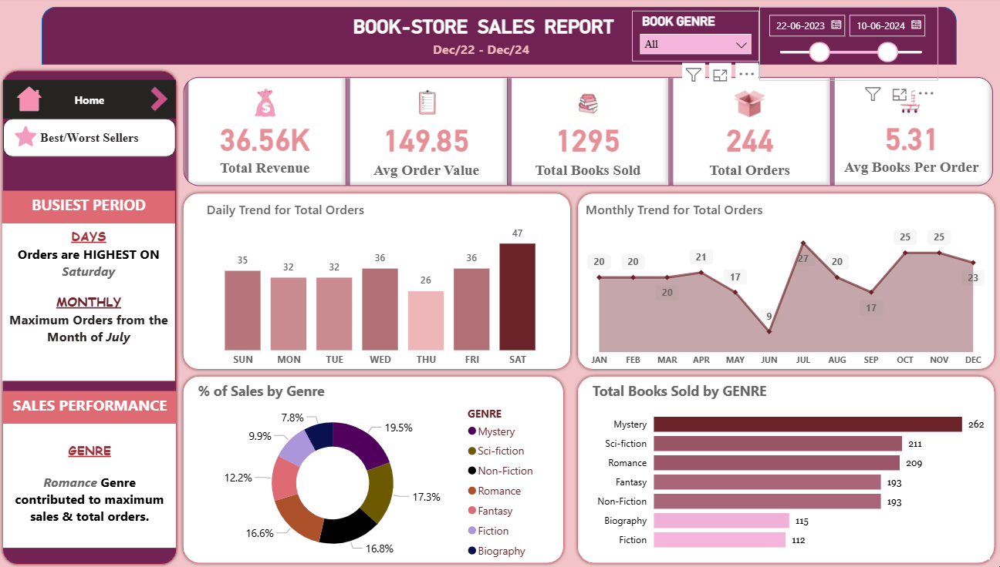

# 🏪 BookStore-Sales-Report





## Project Overview
-- Book store Sales Dashboard analyzes over 500 book sales transactions, enabling users to explore sales trends, performance by genre, and identify top-selling books and authors through dynamic charts and KPIs.

### Dashboard File:

My Final Dashboard is in 

### Key Features:

-**Interactive Visuals:** 
KPI cards- displaying Total Revenue, Average Order Value, Total Books Sold, Total Orders, Average Books per Order.
Column Chart- for daily trend for total Orders, TOP Best selling Authors
Area chart- for monthly trend for Orders
Donut Chart- for Percentage of Sales by Book Genre
Bar Chart- for Total books sold by Genre, TOP/BOTTOM 5 Books by Revenue

-**Dynamic Filtering:** Slicers- Genre Filter (Dropdown) to filter the entire report to show data for only one or more book genre.
Navigator Buttons- to switch between the two dashboards.

-**Advanced SQL Functions:**  Utilizes COUNT(DISTINCT), DATENAME, CAST, (SUM() / COUNT()), aliasing (AS), subqueries, WHERE, GROUP BY, and ORDER BY for complex data aggregation, accurate calculations, and insightful analysis.

-**Advanced Power BI Features:**  Utilizes DAX measures, Power Query transformations, Conditional Formatting, Page Navigation buttons, Slicers, and Data Validation via cross-verification with SQL results for dynamic, accurate, and professional visualization.

-**Business Value:**  Enables publishers, bookstore managers, and authors to make informed decisions about inventory planning, marketing focus, promotional strategies, and editorial acquisitions based on real-world sales trends and genre popularity.

---

### SQL Skills Used
*SQL*:  Complex Query Writing, Aggregation Functions (SUM, COUNT(DISTINCT)), Date Functions (DATENAME, MONTH), Data Type Conversion (CAST), Subqueries, Conditional Filtering (WHERE clauses)

*Data Validation*:  Ensuring accuracy by using SQL as the single source of truth for all calculated metrics.

*Analytical Thinking*:  Structuring queries to solve specific business problems and extract key performance indicators (KPIs).

### Power BI Skills Used
*Power BI*:  DAX Measure Creation, Power Query, Data Modeling, Interactive Slicers, Conditional Formatting, KPI Card Visuals.

*Data Visualization*:  Designing interactive, multi-page dashboards for actionable insights into sales trends and product performance.

*UI/UX Design*:  Implementing intuitive navigation, clear layout, and user-friendly filters for an enhanced analytical experience.

---

## Bookstore Sales Dataset

The dataset used for this Project contains real-world book store sales information from 2022 to 2024. It includes detailed information on:

- **Book Titles**
- **Order_id**
- **Book_id**
- **Title**
- **Quantity**
- **Order_date**
- **Price**
- **Total_amount**
- **Genre**
- **Author**

---
## SQL Use Case: Ensuring Data Integrity

We used SQL as our single source of truth to validate all calculations and business logic before building visualizations. By writing complex queries to calculate KPIs, filter data, and analyze trends, we ensured the accuracy and reliability of the metrics displayed in Power BI. This foundational step guaranteed that our dashboard insights were built on verified data.

## Dashboard Build 

### 📉 Charts

#### 📚 Percentage of Sales by Book Genre - Donut Chart

-  **Power BI Features**:
- Utilized the donut chart visual with data labels formatted to show percentages.
-  **Design Choice**: Donut chart to clearly show part-to-whole relationships and emphasize the contribution of each genre.
-  **Data Organization**: Sorted categories by their percentage of total sales.
-  **Insights Gained**: This enables quick identification of the most popular genre, noting that the Romance Genre generates the highest proportion of revenue.

#### 📅 Daily Trend for Total Orders - Column Chart

- **Power BI Features**: 
Utilized a clustered column chart with conditional formatting applied to the bars based on order value.
- **Design Choice**: Vertical columns to effectively show and compare order volumes across days of the week.
- **Data Organization**: Used a custom 'Day Number' column to ensure correct sorting from Sunday to Saturday.
- **Insights Gained**: Instantly reveals the busiest days of the week (Friday and Saturday), which is crucial for staffing and inventory planning.

#### 📈 Monthly Trend for Orders - Area Chart

- **Power BI Feature**: 
Utilized an area chart with markers to highlight data points and a shaded area for visual impact.
- **Design Choice**: An area chart to effectively show the overall trend and volume of orders over time.
- **Data Organization**: Sorted months chronologically from January to December and formatted the Y-axis for clarity.
- **Insights Gained**: Clearly identifies seasonal trends and peak months, helping in 
long-term business planning and marketing strategy.

#### 📊 Total Books sold by Genre - Stacked Bar Chart

- **Power BI Features**: 
Utilized the funnel chart visual to represent a progressive process.
- **Design Choice**: A Bar Chart to intuitively show which category has the highest volume of pizzas sold, creating a clear visual hierarchy.
- **Data Representation**: Plotted the total quantity of books sold for each Genre.
- **Insights Gained**: Enables a quick grasp of volume disparities between categories, highlighting that the Mystery Genre Category sells the most units.

---

### 🧮 Formulas and Functions

```
total_revenue = SUM(bookstore[total_price])
```
```
total_Orders = DISTINCTCOUNT(bookstore[ORDER_ID])
```
```
Avg_Books_Per_Order = [Total Books Sold] / [Total Orders]
```
```
Avg_Order_Value = [Total Revenue]/[Total Orders]
```
```
Total_Books_Sold = sum(bookstore[QUANTITY])
```
```
Order_Month = UPPER(LEFT(bookstore[Month Name],3))
```
```
Order_Day = UPPER(LEFT(bookstore[Day Name],3))
```


--

These formulas calculate the foundational metrics for the sales dashboard: 
Total_Revenue sums all sales value, Total_Orders counts unique transactions to avoid duplication, and Total_Books_Sold sums all items purchased. From these, Avg_Order_Value determines the average amount spent per transaction, and Avg_Books_Per_Order finds the average number of items per order. Finally, Order_Month and Order_Day extract and abbreviate date parts for clear trending and analysis on the charts.

---


## Conclusion

This project significantly strengthened my expertise in SQL, Power BI, data modeling, and advanced analytics. It provided a deep dive into sales trends and customer behavior patterns within the publishing industry, enabling me to transform raw bookstore transactions into actionable, strategic insights presented through a dynamic and user-friendly dashboard. The end-to-end process—from data extraction and validation to visualization and storytelling—honed my ability to deliver data-driven solutions that directly inform inventory management, marketing strategies, and overall business decision-making strategy.
